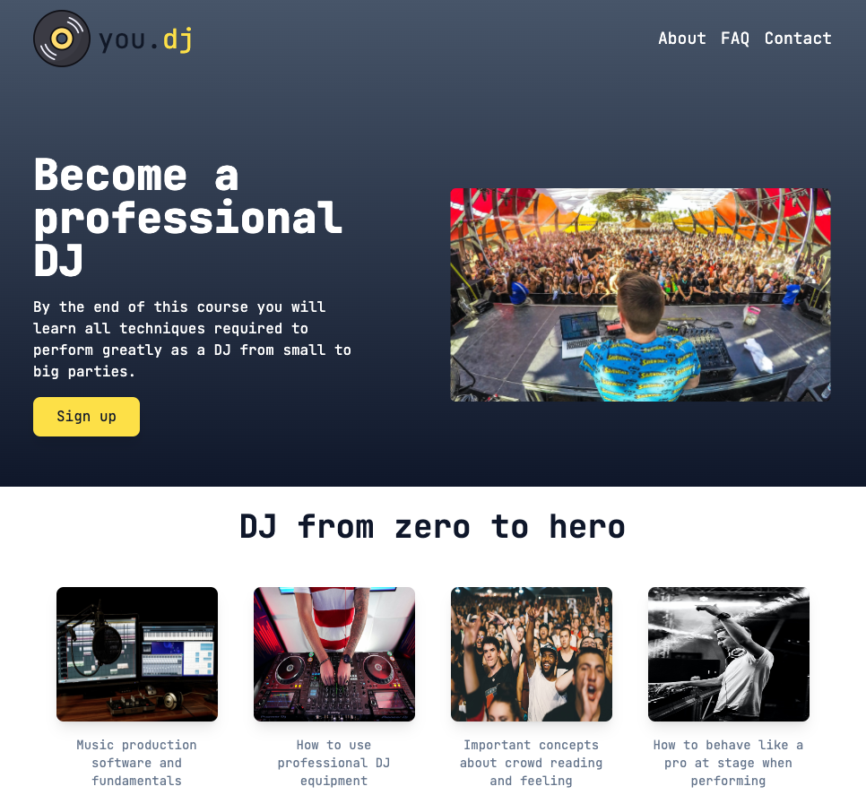
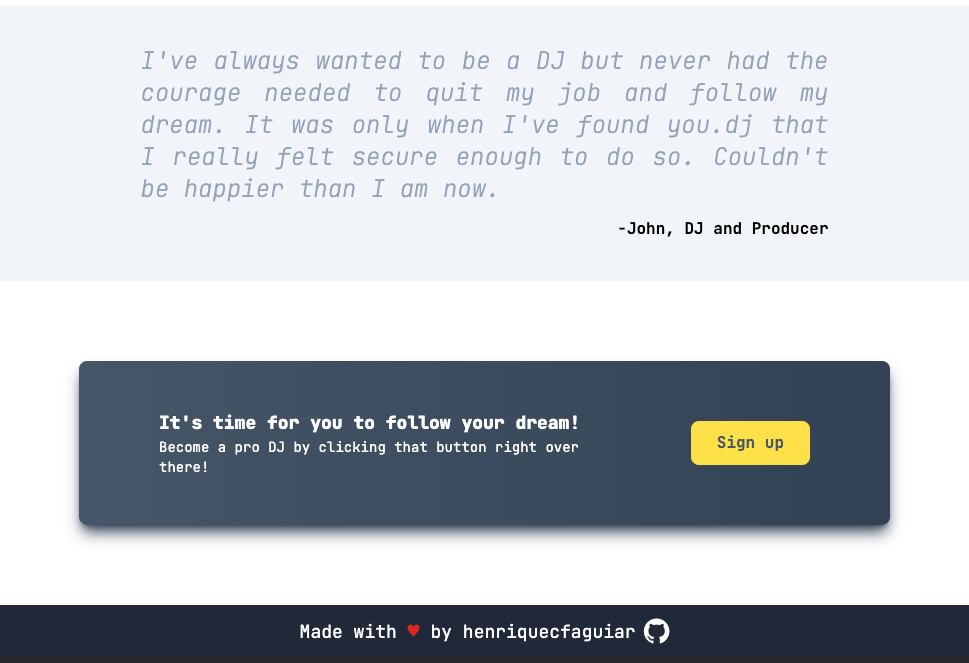

# you.dj

Landing page about a fictional company named you.dj that offers a course that helps aspiring DJ's to follow their dream.

> Hero and information sections
> 

> Quote and CTA sections
> 

## Atribuition:

### Photos

- [Eric Ward](https://unsplash.com/photos/uD0W-swVGgE)
- [Bru-nO](https://pixabay.com/photos/studio-music-mixer-audio-1004158/)
- [Gaby Tenda](https://www.pexels.com/photo/person-using-dj-mixer-2717073/)
- [Nicholas Green](https://unsplash.com/photos/nPz8akkUmDI)
- [Mwabonje](https://www.pexels.com/photo/photo-of-disc-jockey-performing-1694900/)

### Icons

- Music and multimedia icons created by Mihimihi - [Flaticon](https://www.flaticon.com/free-icons/music-and-multimedia)

## [Live Demo](https://henriquecfaguiar.github.io/you-dj-landing-page/)
